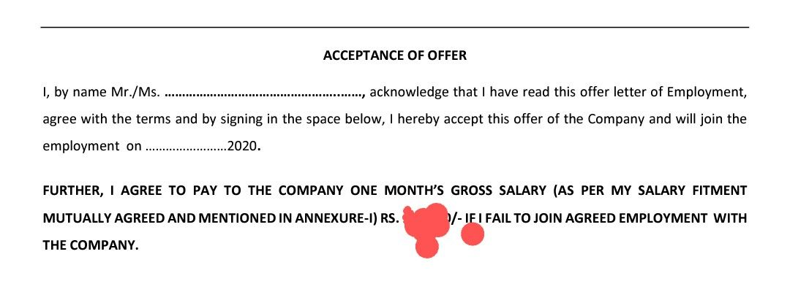

# Objective
Creating this repo to document all the red flags which can help you avoid wrong employers

1. A employement contract which asks you to pay an amount in case you are not able to join the company after accepting the offer before employement commencement

E.g. 

