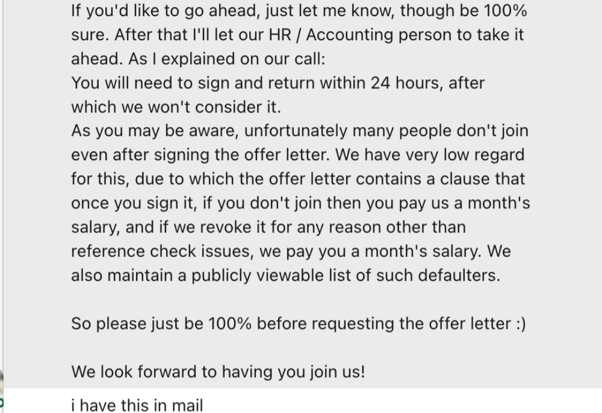

# Objective
Creating this repo to document all the red flags which can help you avoid wrong employers

1.
An employement contract which asks you to pay an amount in case you are not able to join the company after accepting the offer before employement commencement. For e.g. I received this screenshot in a closed group. Ideally if you see this clause, run in the other direction.
This is basically a company which does not understand that an organization is significantly more powerful than an individual and thus does not mind intimidating you with a financial penalty. Trust me you'll find better options than this.

2.
The company maintains publicly viewable list of people who declined to join after accepting the offer

🤦‍♂️🤦‍♂️

Just tells that this company takes things personally
to the point that they don't mind publicly shaming you.

Avoid such folks if you can.

